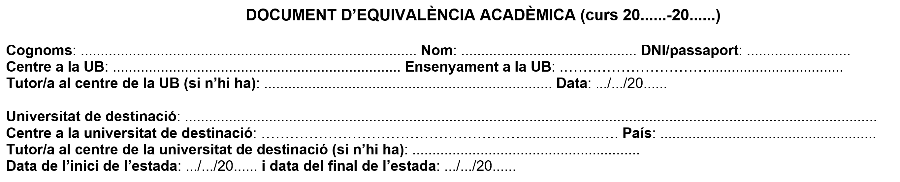
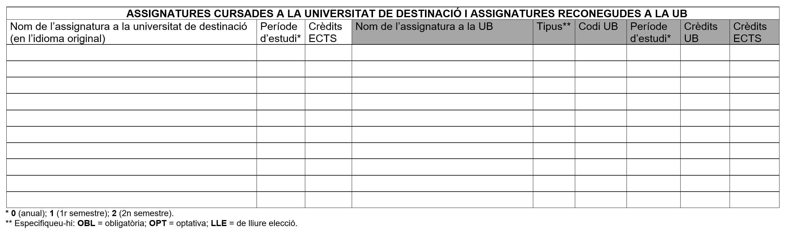
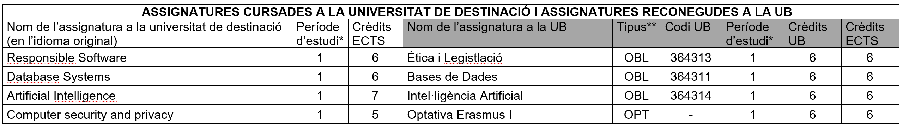
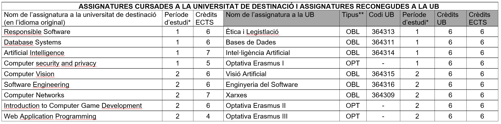
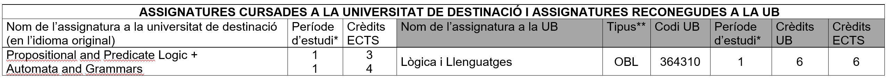
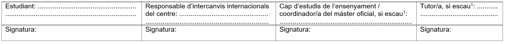

# 🧾 Guia per omplir el DEA

Aquesta pàgina t’ajudarà a emplenar correctament el **Document d’Equivalència Acadèmica (DEA)** que cal presentar per validar les assignatures cursades durant una mobilitat (Erasmus o altres programes internacionals).

```{note} Recorda 🟢
:class: tip
Si has arribat fins aquí, és que tens:
1. Assignatures triades.
2. Confirmació de la **viabilitat de convalidació** per part de les persones responsables del grau.
```

El DEA es divideix en **tres parts principals**:

1. Informació de l’estudiant i dels centres.
2. Taula d’assignatures, similar al pre-DEA.
3. Signatures i validacions finals. ⚠️ Molt important!

Repassarem cada ítem amb exemples perquè puguis omplir el teu document DEA sense complicacions.

---

## 🩵 Part 1. Informació de l’estudiant i dels centres

Completa amb cura totes les dades personals i institucionals.



### 📄 Camps a omplir

- **Cognoms i nom:** escriu-los tal com apareixen al DNI o passaport.  
- **DNI o passaport:** comprova que el número sigui correcte i llegible.  
- **Centre a la UB:** facultat o centre on estàs matriculat/ada (p. ex.: *Facultat de Matemàtiques i Informàtica*).  
- **Ensenyament a la UB:** grau o màster concret (p. ex.: *Grau en Matemàtiques* o *Màster en Data Science*).  
- **Tutor/a a la UB:** persona tutora assignada al teu centre.  
- **Data:** dia d’emplenament del document.  
- **Universitat de destinació:** nom complet de la universitat estrangera.  
- **Centre a la universitat de destinació:** facultat o escola dins la universitat d’acollida.  
- **País:** país de la universitat de destinació.  
- **Tutor/a al centre de destinació:** si n’hi ha, escriu el nom complet i el càrrec.  
- **Dates de l’estada:** data d’inici i final del període de mobilitat.

---

## 📘 Part 2. Assignatures i equivalències

En aquesta taula s’indiquen les **assignatures cursades a la universitat de destinació** i les **assignatures reconegudes a la UB**. Aquí és on **hauries d’afegir** les assignatures prèviament aprovades al pre-DEA.



---

### 📋 Camps de la taula

| Columna | Què cal posar | Exemple |
|----------|----------------|----------|
| **Nom de l’assignatura a la universitat de destinació** | Títol complet en l’idioma original | *Introduction to Quantum Computing* |
| **Període d’estudi\*** | `1` = 1r semestre, `2` = 2n semestre, `0` = anual | 1 |
| **Crèdits ECTS (destinació)** | Crèdits segons el pla d’estudis de la universitat de destinació | 6 |
| **Nom de l’assignatura a la UB** | Assignatura equivalent reconeguda per la UB | *Introducció a la Computació Quàntica* |
| **Tipus\*\*** | `OBL` = obligatòria · `OPT` = optativa · `LLE` = lliure elecció | OPT |
| **Codi UB** | Codi oficial de l’assignatura (consulta la guia docent) | 430001 |
| **Període d’estudi (UB)** | El mateix valor que a la columna *Període d’estudi* | 1 |
| **Crèdits UB** | Crèdits oficials segons el pla de la UB | 6 |
| **Crèdits ECTS (UB)** | Normalment coincideixen amb els anteriors | 6 |

\* `0` (anual); `1` (1r semestre); `2` (2n semestre)  
\*\* `OBL` = obligatòria, `OPT` = optativa, `LLE` = lliure elecció  

### 💡 Consells pràctics

- Es poden **agrupar o dividir assignatures** si no hi ha correspondència exacta.  
- El total de crèdits ha de ser **coherent amb el programa de mobilitat**.  

---

### Exemples de DEAs amb casuística especial

:::{note} Exemple 1 — DEA simple per a un semestre
:class: dropdown

Exemple d’un DEA ben redactat per a una estada d’un semestre, amb algunes assignatures obligatòries i una d’optativa.


:::

:::{note} Exemple 2 — DEA simple per a dos semestres
:class: dropdown

Exemple d’un DEA ben redactat per a una estada de dos semestres, amb algunes assignatures obligatòries i d’altres optatives.


:::

:::{note} Exemple 3 — DEA 2×1
:class: dropdown

Exemple d’un DEA ben redactat per a un cas en què **dues assignatures a l’estranger** es convaliden per **una a la UB**. Considera que, en aquest cas, el contingut d’aquestes dues assignatures es complementa i, en fer-ho, s’equipara millor amb el temari de l’assignatura de la UB. A més, en aquest exemple, les dues assignatures tenen un nombre reduït de crèdits (3+4), cosa que també genera un millor equilibri en considerar-les conjuntament.



> Recorda: la nota de l’assignatura matriculada a la UB serà la **nota ponderada**, segons el nombre de crèdits, de les notes de les **dues assignatures** a la universitat de destinació.

:::

:::{note} Exemple 4 — DEA 2×1 amb equilibri de crèdits
:class: dropdown

Exemple d’un DEA ben redactat per a un cas en què **dues assignatures a l’estranger** es convaliden per **una a la UB**. Considera que, en aquest cas, el contingut de les dues assignatures es complementa i, en fer-ho, s’equipara millor amb el temari de la UB. **Tanmateix**, en aquest cas el nombre de crèdits de les assignatures a la universitat estrangera és **superior** (5+5) al de l’assignatura de la UB. Per tant, la proposta hauria d’intentar equilibrar d’alguna manera el nombre total de crèdits, per exemple: amb l’addició d’una assignatura optativa, tal com s’il·lustra a continuació.


> Recorda: les notes de les assignatures matriculades a la UB seran la **nota ponderada**, segons el nombre de crèdits, de les notes de les **dues assignatures** a la universitat de destinació.

:::

---

## 🖋️ Part 3. Signatures i validacions

Aquesta secció confirma que totes les parts estan d’acord amb les equivalències proposades.



### ✍️ Han de signar (i en aquest ordre):

1. **L’estudiant**  
2. **La persona responsable d’intercanvis internacionals del centre**  
3. **El/la cap d’estudis** (o **coordinador/a del màster oficial**)  
4. **El/la tutor/a** (només si el centre ho requereix)

---

> 🪶 *Aquest document serveix com a guia orientativa. Consulta sempre la persona coordinadora de mobilitat abans d’entregar el DEA definitiu.*